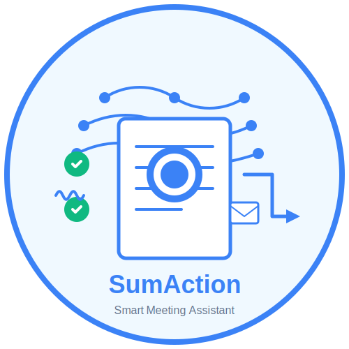
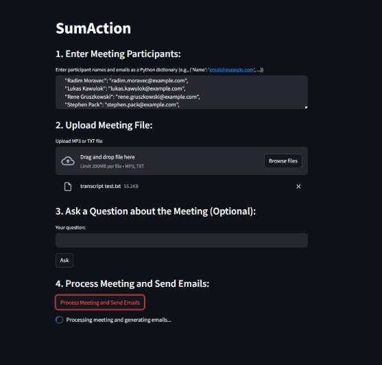
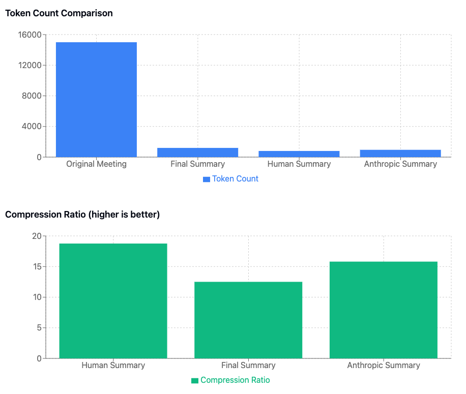
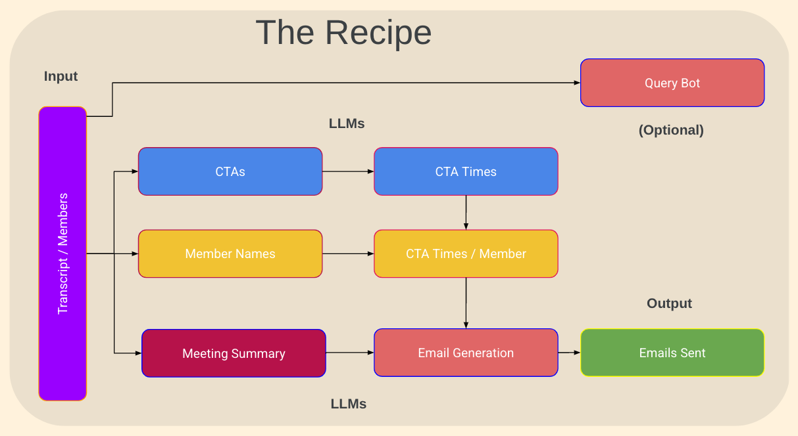

# Meeting-Bot

<h1 align = "center" > SumAction </h1>
<h3 align = "center" > Plan your week and get ahead of everyone! </h3>
<p align = "center" >
    
    </p>

## Executive Summary  

The **SumAction** AI Meeting Productivity tool analyzes your uploaded meeting notes (formats supported: text, video, audio) and uses AI to deliver a concise summary of the meetings, key learnings, along with a list of action items and a estimate of the task. The tool allows you to increase your productivity by taking care of the menial tasks of emailing attendees their specific tasks, giving you the opportunity to be more productive or just a rest from the daily rigmarole.

We leveraged OpenAI, its LLMs, and engineered prompts that were effective in creating our productivity tool to summarize uploaded meeting notes (Audio, Video, Text) and to extract action items.  

## Table of Contents  

- [Project Overview](#project-overview)  
  - [Project Requirements](#project-requirements)  
  - [Data Collection](#data-collection)  
  - [Expected Outcome](#expected-outcome)
- [Findings](#conclusion)
  - [Summarizer Evaluation](#summarizer-evaluation)
  - [Lessons Learned](#lessons-learned)
  - [Next Steps](#next-steps)  
- [Data Sources](#data-sources) 
- [Team Members](#team-members)
- [Presentation](https://docs.google.com/presentation/d/1AzPwQFdch-ddu_zMHq6gZLve8eZgW3cTcu9Ity84A0Y/edit?slide=id.g3535ae97fff_0_1007#slide=id.g3535ae97fff_0_1007)

## Project Overview  
We Americans love our meetings! We often find ourselves spending a significant portion of our waking hours in back-to-back meetings. Research indicates that professionals spend an average of 20-25 hours every week in meetings. Furthermore, individuals spend an additional 30-45 minutes on post-meeting activities, including compiling notes, action items, and follow-up tasks. This becomes even more challenging in today's fast-paced work environment, where many of us transition seamlessly from one meeting to the next. The constant context switching and information overload can lead to decreased productivity, increased stress, and a struggle to effectively manage workloads.

Our team is developing an innovative solution that leverages the power of Large Language Models (LLMs) and intelligent bots to dramatically increase meeting productivity. We aim to address these challenges by creating a suite of tools that automate critical meeting-related tasks, allowing professionals to focus on higher-value activities. 

<h1 align = "left" > SumAction </h1>
<h3 align = "left" > Plan your week and get ahead of everyone! </h3>
<p align = "left" >
    
    </p>


Our solution offers the following key features:
1. **Automated Summarization:** Our bot automatically generates concise and accurate summaries of meeting discussions, capturing key points and decisions. This eliminates the need for manual note-taking and ensures that all participants have a clear record of what was discussed.

1. **Action Item Tracking and Assignment:** The bot intelligently identifies and extracts action items from meeting conversations, automatically assigning them to responsible parties. This ensures clear accountability and prevents action items from falling through the cracks.

1. **Automated Distribution:** Summarized notes and assigned action items are automatically distributed via email to relevant participants, streamlining communication and ensuring that everyone stays informed.

1. **Action Item Effort Estimation: (Key Differentiator)** Unlike existing solutions, our bot goes beyond simple action item tracking. It leverages LLMs to provide effort estimates for assigned action items. This unique feature enables users to:

    1. ***Improve Project Planning:*** Accurately estimate the time required for each task, facilitating more effective project planning and resource allocation.

    1. ***Optimize Scheduling:*** Better manage individual workloads and schedules by understanding the effort involved in completing assigned tasks.

    1. ***Proactively Manage Delays:*** Identify potential bottlenecks or scheduling conflicts early on, allowing for proactive mitigation and ensuring timely deliverable completion.

1. **Aggregated Action Item Management: (Key Differentiator)** Our solution also gathers and consolidates all action items assigned to individual users across all their meetings within a given day. This provides a comprehensive overview of daily responsibilities, enabling users to:

    1. ***Prioritize Tasks Effectively:*** Gain a holistic view of their workload, allowing them to prioritize tasks based on urgency and importance.

    1. ***Optimize Daily Workflow:*** Plan their workday more efficiently by understanding the full scope of their commitments.

    1. ***Enhance Time Management:*** Proactively manage their time and avoid feeling overwhelmed by fragmented action items spread across multiple meetings.

1. **Contextual Query Bot:** We have also developed a query bot that allows users to quickly retrieve specific information from past meetings. This bot enhances recall and facilitates efficient context gathering, enabling users to:

    1. ***Quickly Find Information:*** Avoid spending valuable time searching through lengthy meeting transcripts or notes.

    1. ***Improve Decision Making:*** Access relevant historical information to make more informed decisions.

    1. ***Onboard New Team Members:*** Quickly bring new team members up to speed by providing them with easy access to past meeting discussions.


  <h3 align = "left" > Scan Below to access the SumAction Meeting Transcription App </h3>
  <p align = "left" >
  
    </p>
    
By automating these time-consuming and often tedious tasks, our AI-powered meeting bot empowers professionals to reclaim valuable time, reduce stress, and focus on the substantive aspects of their work.

## Project Requirements
Please review the 'requirements.txt' file in the Resources folder to get a complete overview of the entire set of libraries that are needed to run the program.
Use the single line to run the command within the Jyupter Notebook | [!pip install -r requirements.txt. ]
- **Software Requirements:**
  - [Python 3.12.9 or greater](https://www.python.org/)   
  - [Jupyter Notebook](https://jupyter.org/)
  - GitHub account   
  - Load Dependancies: 
    ```
    streamlit
    pandas
    langchain
    langchain-openai
    langchain-community
    openai
    sentence-transformers
    faiss-cpu
    rapidfuzz
    ```
- **GitHub Repository Structure:**
``` Markdown for Clean display of GitHub Repository Structure
  📦Meeting-Bot 
      ┣ 📂Nik_folder  (Project Notebooks: Summarizer, Action Extractor, Email Developer / Collector and MailAgent)
      ┣ 📂Zain_folder (Project Notebooks: Summarizer, Action Extractor, Evaluator, TaskEstimateBot, Q&A Query)
      ┣ 📂Resources (Meeting recordings, CommonTasks.csv, sumaction-logo.png, Token_count_compression_ratio.png) 
      ┣ 📜.gitignore
      ┣ 📜LICENSE 
      ┣ 📜README.md
      ┣ 📜requirements.txt
      ┣ 📜sumaction_utils.py
      ┗ 📜sumaction.py

```
- **For Project Files, see:**
    - /zain_folder/Zain_meeting_ai_workspace.ipynb
    - /nik_folder/meeting_ai_workspace.ipynb

  
## Data Collection 
- (Also See [Data Sources](#data-sources))  
1. Public Meetings:  
    - Initial assessment conducted to understand the data and identify any issues.
        - Read in meetings from the dataset that included full notes and summaries.
      
2. Zain's Meeting Notes:
    - Actual meeting notes (NOT Included in the resources as they were only used for testing the evaluator: Bleu, ROUGE, Tokens).
    - Additional formatted examples were also include to test the solutions transcribe capabilities (video/ audio > text).
    - Multiple Meeting notes that were hand written by a human for summarizer evaluation.


## Expected Outcome
- GOAL: Have the our solution properly transcribe meeting notes, create a summary *(high accuracy, precision and recall)*, extract action items, assign a task estimate to them, and lastly send the summary and action items out to relevant users. 


## Visualizations  

- Plot of Token Count/ Compression Ratio,

 
- SumActions LLM Recipe

  
## Summarizer Evaluation: 
We wanted to ensure that SumAction’s summarizer was up to the task. While the prompts get all the spotlight, as we know the outputs are generated based on the level of detail and clarity provided, we wanted to evaluate how good our summary was. Measuring the performance of text generation tasks like summarization or translation is not as straightforward. Applying some sort of exact match between the generated summary and the label is not a good solution — even humans would fare poorly under such a metric, because we all have our own writing style. One of the most commonly used metrics for summarization is the **ROUGE score** *(short for Recall-Oriented Understudy for Gisting Evaluation)* or **BLEU** *(bilingual evaluation understudy)*.

- ***Bleu measures precision:*** how much the words (and/or n-grams) in the machine generated summaries appeared in the human reference summaries. 
- ***Rouge measures recall:*** how much the words (and/or n-grams) in the human reference summaries appeared in the machine generated summaries.

The methods essentially compare a generated summary against a set of reference summaries that are typically created by humans. 

***Tokens:*** We also looked at the Token Count / Compression ratios as they reveal how efficiently a summarization model reduces the original text while preserving its meaning. Token count indicates the number of word fragments (tokens) in a piece of text, while compression ratio measures the reduction in token count between the original text and its summary. 

Long story short, SumAction is doing a good enough job to summarize meeting notes and call out learnings. NOTE: We also compared how our models output compared to that of another models output and can see a lot more similarity in recall and precision scoring … which kinda points to that the models are converging closer to each other Or despite being named differently, they had a similar training set.

## Lessons Learned
----------
- Prompt engineering is definitely an art! Just changing single words in the prompt can completely change up the response (eg. Using the work 'Unique').
- LLMs and bot responses are definitely converging (feel the training datasets for LLMs were quite close - OpenAI vs. Gemini vs. Anthorpic).
- Its getting really easy to build applications that can help increase productivity, but this comes at the expense of what traditionally took some cognitive creative thinking.
- A high frequency # of calls to OpenAI can get expensive really quick, especially using the new models.
- One must explore the langChain chains to and determine the right 'chain' for the agents.

**Cost Of Project**
Using the following average Colorado salary scales for team member roles, we were able to calculate the cost of conducting this project. 

- Software (1): $109,223 | *(per week cost = $2100.44)*
- Prompt Manager (1): $110,823 | *(per week cost = $2131.21)*
- Cost per meeting (OpenAI) transcription (Summary, Action Items, Email): $0.35
  - Current Budget: $20
- App Hosting Cost: $500/month 

Total Cost Creating App (2 weeks) = $8483.30 
  

## Next Steps:
The application developed can be used by anyone wanting to better manage, plan, and prioritize their work. While the application is currently usable and can be marketed, we'd still like to:
- Half the number of calls to OpenAI (Currently 6 calls, need to half that, especially the ones to the more expensive models).
- Create Calendar events w/ assignments # of days prior to assignment being due.
- Coalesce all events for user and help them understand ALL of their end-of-day assignments.
- Build in prioritization and memory so that user can query system to better plan deliverables for the upcoming work week.
- Build integrations with other Task management tools, or virtual meeting services.
- Hallucinations are inevitible, so we need to continue to find a way to identify / still incorporate users into the loop prior to send.
  - Enhance the user experience for user verification. 

----------------------------------------------------------------------------------------------------------------------------------------------------------------------------------------------------------------------------
## Appendix
## Data Sources:
### Meeting Data Sources:
- [Public Meetings](https://github.com/pltrdy/public_meetings):
This corpus contains meetings, made of pairs of (a) automatic transcriptions from audio recordings, (b) meeting reports written by a professional.

- [59+ Meeting statistics](https://www.crossrivertherapy.com/meeting-statistics):
Research on Meeting Statistics and Data that was incorporated into the project.

- [SumAction Project Presentation](https://docs.google.com/presentation/d/1AzPwQFdch-ddu_zMHq6gZLve8eZgW3cTcu9Ity84A0Y/edit?usp=sharing):
Presentation our products capabilities and next steps.


## Team Members:  
AI Software Engineer/ ML Engineer: Nik Psyllas

AI Prompt Engineer / Product Manager: Zain Master  
